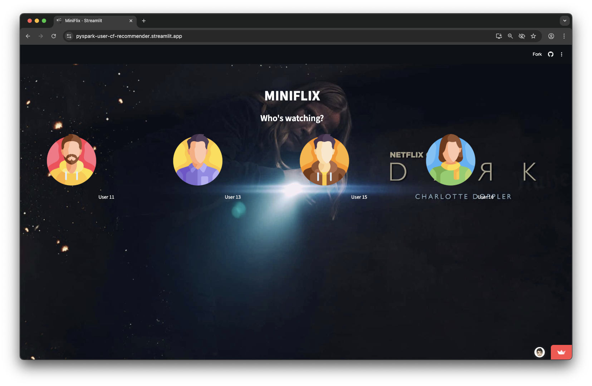
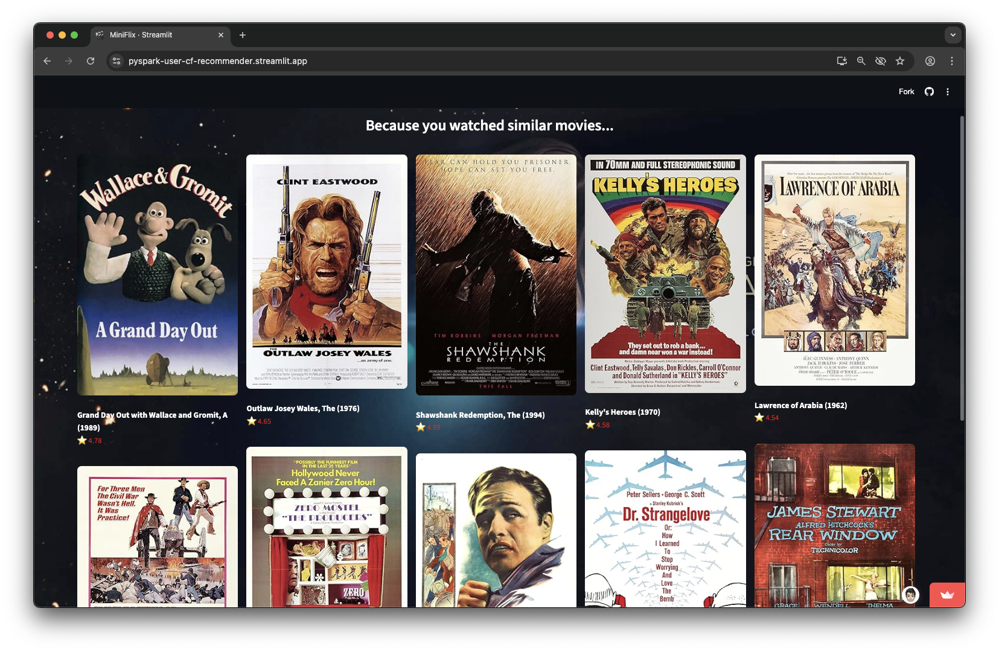

# 🎬 MiniFlix — User-Based Collaborative Filtering Movie Recommender

A Netflix-style movie recommendation system built with PySpark 

## Streamlit
Check out the app here: [Streamlit App]()

---

## **Overview**

**MiniFlix** is a user-based collaborative filtering recommendation engine that predicts movie ratings and recommends similar movies for each user.

The project uses:
- **PySpark** for large-scale similarity computation and rating prediction (offline phase)
- **Pandas + Streamlit** for lightweight, instant recommendations (online phase)
- **OMDb / TMDb APIs** to fetch movie posters dynamically

---

##  **Architecture**

Offline (Jupyter + PySpark)  
│   
[ratings.csv, movies.csv, links.csv]  
│  
Spark computes user–user similarities  
│  
Precomputed predictions_user*.csv  
│  
Online (Streamlit Cloud)  
│  
Reads CSV on selected users precomputed predictions
|
API call to get posters and details of the movie
|
Displays Recommendations

Note: 
The notebook is also added at the notebooks folder.

## Dataset

The dataset used is from the **MovieLens** project
It is taken from !(https://github.com/sankalpjain99/Movie-recommendation-system.git)

avatars are from flaticon.com

#Streamlit screenshots

